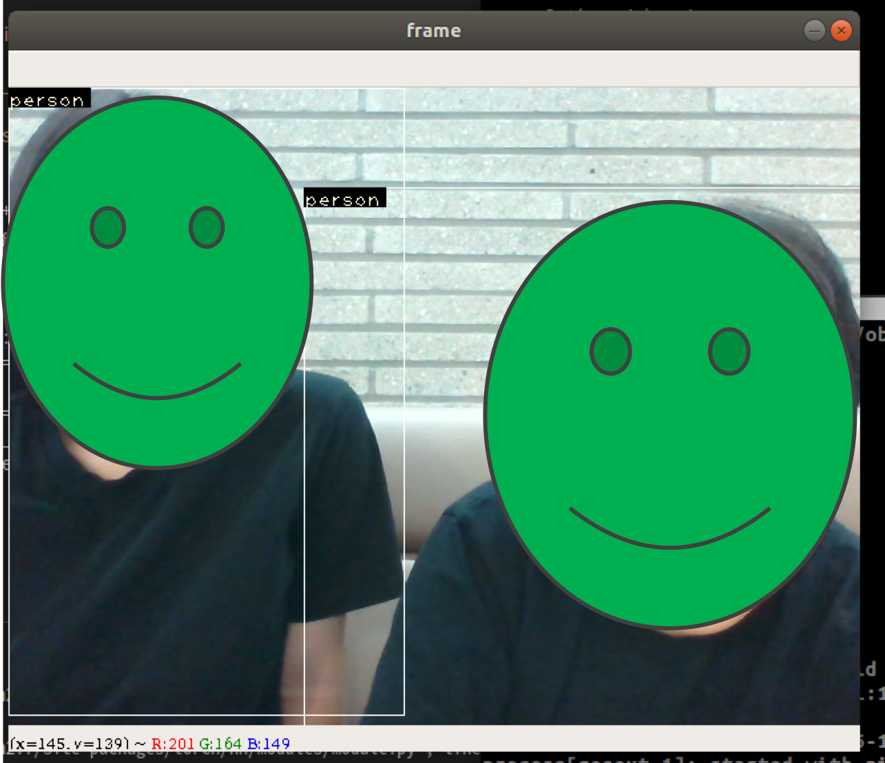

YOLO : Detect Person & Traffic sign
==================

## REASON TO USE

세부 시나리오에서 설명한 사람감지 및 교통신호 판별을 위해 사용한다.

## 실행 방법

### python2.7 및 python3.6 등에서 사용할 수 있습니다.

    git clone https://github.com/happyOBO/ZumiGamma
    cd YOLO
    wget http://pjreddie.com/media/files/yolov3.weights
    python3 cam_demo.py

## 주요 코드 설명 : cam_demo.py

    cfgfile = "cfg/yolov3.cfg" # call yolov3.cfg. You can use other cfg file.
    weightsfile = "yolov3.weights" # call yolov3.weights. Yo can use other weight file too.
    def write(x, img):
        ...
        if label == 'traffic light': # If the frame detect 'traffic light'
            ...
            blue_range = cv2.inRange(hsv, lower_blue, upper_blue)
            green_range = cv2.inRange(hsv, lower_green, upper_green)
            red_range = cv2.inRange(hsv, lower_red, upper_red)
            blue_result = cv2.bitwise_and(dst, dst, mask=blue_range)
            red_result = cv2.bitwise_and(dst, dst, mask=red_range)
            green_result = cv2.bitwise_and(dst, dst, mask=green_range)
            r = np.mean(red_result)
            g = np.mean(green_result)
            b = np.mean(blue_result)
            if max(r,g,b) == r : # red_light
                print("red!")
            elif max(r,g,b) == g : # green_light
                print("green!")
            elif max(r,g,b) == b : # blue_light
                print("blue!")
            else :
                print("I Don't know color!")
    return img

## 실행화면

