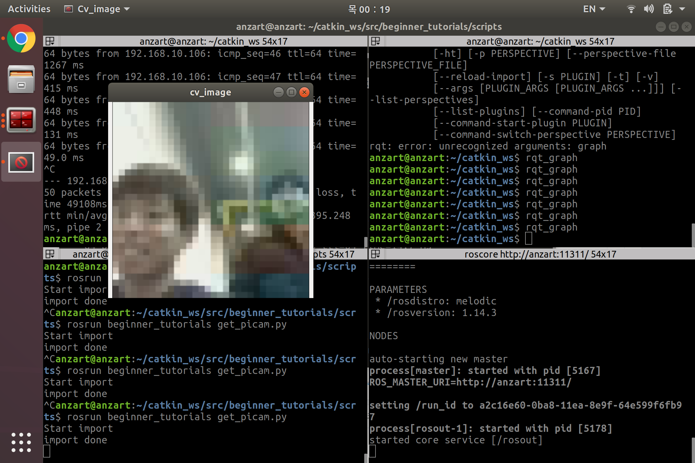

라즈베리파이제로(RPI)에서 파이카메라 영상 스트리밍하기
==================

## 개요

### 왜 만드는가?(WHY) 

Zumi 플랫폼은 라즈베리파이제로(이하 RPI)를 메인 컴퓨터로 사용합니다. 그리고 팀의 목표에 따라 자율주행을 구현하기 위해 영상을 사용하기로 했습니다. 우리는 사람과 몇 가지 물체를 인식하기 위해서 YOLO를 사용하기로 결정했고 RPI의 컴퓨팅 파워로 제대로된 성능을 기대할 수 없기 때문에 다른 컴퓨터에 RPI의 영상을 스트리밍하게 되었습니다. 

### 무슨 기능인가?(WHAT) 

RPI에서 장착되어있는 파이카메라의 프레임을 ROS를 이용해 sensor_msgs.msg/Image.msg 형태의 토픽을 publish합니다. 

### 어떻게 작동하는가?(HOW) 

Github 홈페이지에서 코드별로 설명이 나와있습니다. 그것을 참고해주세요. 

## 코드 분석(picam2.py)

25번줄까진 초기 세팅 작업입니다. 주석을 참고해주세요.

    29. cap = cv2.VideoCapture('/dev/video0') 

파이카메라가 연결되어있는 포트를 연결해 파이카메라를 켭니다.

    33. cap.set(3, 30)
    34. cap.set(4, 30)

카메라의 해상도를 30*30으로 설정합니다.

    38. ret, frame = cap.read()

파이카메라로부터 프레임을 받아옵니다.

    46. cv_image = bridge.cv2_to_imgmsg(frame, "bgr8")

받은 프레임을 ROS에서 전송할 수 있는 메세지 형태로 변환해줍니다.

    49. pub.publish(cv_image)

변환된 프레임을 토픽으로 발행합니다.

## 코드 분석(get_picam.py)

    21. rospy.Subscriber('chatter', Image, callback)
    
'chatter' 토픽으로부터 파이카메라 프레임을 받습니다.

    15. cv_image = bridge.imgmsg_to_cv2(data, "bgr8")
   
Image 형태의 데이터를 opencv에서 사용할 수 있게 바꿔줍니다.
이제 opencv 라이브러리의 함수들을 프레임에 적용할 수 있습니다.
이번 코드에선 원본 영상이 어떻게 나오는지 확인해보겠습니다.

    16. cv2.imshow("cv_image", cv_image)
    17. cv2.waitKey(1)
    
"cv_image" 라는 이름의 윈도우 창에 프레임을 띄웁니다.
버퍼를 기다리기 위해 0.001초 기다려줍니다.

**결과**

